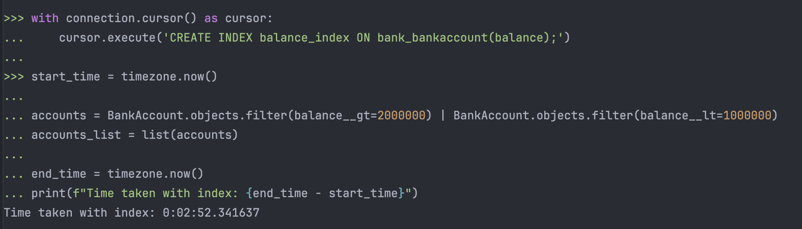

# bank_system_project
* This is a project to learn more about Django ORM
* Created by Ali Moghadasi

The result of time of filtering 10 million accounts without index:

The result of time of filtering 10 million accounts after indexing:

As we can see the time of the query without indexing is less than the time of the query after indexing.